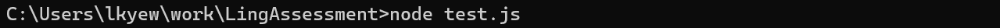
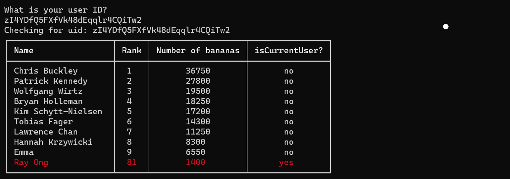

# Ling-Assessment
Done by: Loke Kum Yew

## Note
This soluion is completed with Node.js.

## Dependencies 
Please note that this program utilises the [Console Table Printer Library](https://console-table.netlify.app/docs/) in order to better display the solution.
In order to install this dependency, please run the following command in your command line:
```
npm install console-table-printer --save
```
### Running the Code Without Console Table Printer
In case installation of the Console Table Printer Library is not possible, please make the following changes to the code. 

Remove the comment markers (/* and */) for the section marked as "Start/End of display using normal Console"
such that it resembles this:
```
//---------------------------------Start of display using normal Console Table---------------------------------------------------

function printTableData(){
	console.table(usersDataArray10wCurrent,["name", "rank", "bananas", "bananas", "isCurrentUser?"]);
};

//---------------------------------End of display using normal Console Table-----------------------------------------------------

```

Insert the comment markers (/* and */) for the section marked as "Start/End of display using Console Table Printer Library"
such that it resembles this:
```
//---------------------------------Start of display using Console Table Printer Library-------------------------------------------
//Documentation for Console Table Prnter Library: https://console-table.netlify.app/docs/
/*
const { Table } = require('console-table-printer');
function printTableData(){
.
.
.
.
.
.
for (i in usersDataArray10wCurrent){
		if (usersDataArray10wCurrent[i]["isCurrentUser?"] == "yes"){
			p.addRow(usersDataArray10wCurrent[i],{ color: "red" });
		}
		else{p.addRow(usersDataArray10wCurrent[i]);}
};
	p.printTable();
}
*/
//---------------------------------End of display using Console Table Printer Library---------------------------------------------
```

## Running the Code
In order to run the program, please make a local copy of this repository.
Navigate that the local directory and run the following commands:

```
node test.js
```

In my case, the command line would look like this:


### Using the Interface
You will then be prompted for the user ID that you will want to check.

For user in the top 10 placement you may try
uid: zDHhDho9h5fTDntQhyEg66RMvqK2

For user not in the top 10 placement you may try:
uid: zI4YDfQ5FXfVk48dEqqlr4CQiTw2

Once you key in the correct uid and press enter, you will see the following:


Note that the row with currentUserID will be in red.

